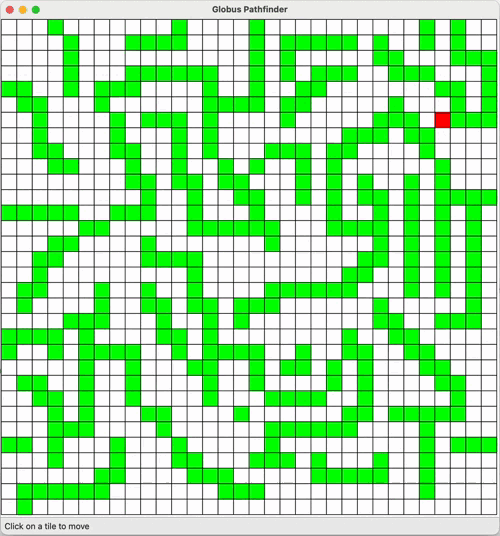
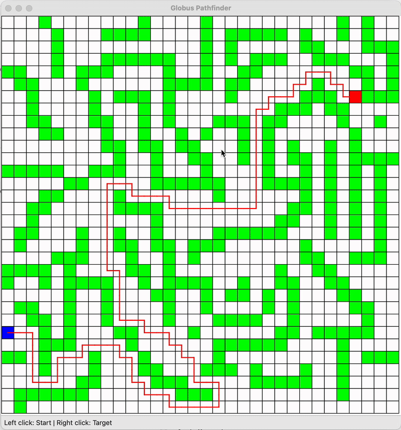
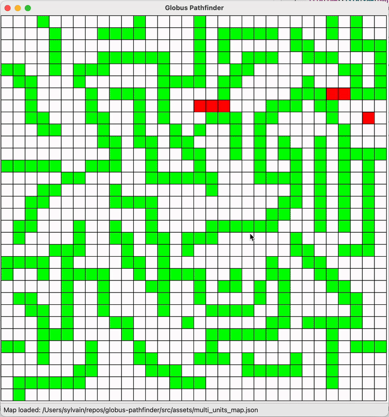

# Globus Pathfinder

## Project Summary
Globus Pathfinder is a Qt-based pathfinding tool that loads grid-based maps from JSON, allows interactive editing of the start/target positions, and visualizes the optimal route directly on the map.

This project is part of a take-home assignment.

## Demo

## Build instructions
The `src` folder contains a standard Qt 6 / CMake project that can be builded with QtCreator or from command line following these instructions:
https://doc.qt.io/qt-6/cmake-build-on-cmdline.html

## Usage
Click on a reachable tile to start moving.

The file menu lets you import or export a map.

## Project Structure
- src/ — Application source code
    - CMakeLists.txt — CMake project file
    - main.cpp — Qt application entry point
    - resources.qrc - Qt resource file to embed the JSON map
    - assets/
        - sample_map.json — JSON Map loaded at the app startup
    - logic/
        - gamestate.{cpp,h} — State management and main clock
        - pathfinder.{cpp,h} — Pathfinding algorithm implementation (A*)
    - models/
        - battleunit.{h} - Model defining a single battle unit
        - gamemap.{cpp,h} - Model defining a map
        - tile{cpp,h} - Model defining a single tile of the map
    - ui/
        - mainwindow.{cpp,h} — Main application window
        - mapview.{cpp,h} — Widget that renders the grid and path.
        - tileitem{cpp,h} - Single tile UI view with click signals
- .gitignore - Git ignore file
- README.md — Project documentation and usage (this file).

## Design Decisions
### Software architecture
I decided to split my code in 3 subfolders: UI, models and logic. This makes it easy to understand and maintain.

The UI is also splitted in 3 classes: 
- MainWindow for the File menu actions and as a container for the map
- MapView for drawing the map and path
- TileItem for drawing a single tile and sending signals when a tile is clicked

### UI/UX
For the UI/UX, I started with a static grid with just the visualization of the start, target and path as shown below:

With this view I was able to test the algorithm easily by changing the start position with the left click and the target position with the right click.

I then decided to implement it like an actual game, where we click to set the target position and it starts the animated travel. It can be interrupted by choosing a new target.

### Pathfinding algorithm
For finding the path to the target position, I thought about 2 possibilities:
- "GPS" approach, meaning we know the full map and we can find the quickest path before starting the travel
- "fog" approach, meaning we only know the tiles around us and where the target is. This is often the case in RTS games where the player discovers the map as it progresses

I chose to pick the first approach because we can easily know the shortest path to the target this way.

For the algorithm, A* is a classic pathfinding algorithm because it's very fast at finding the shortest path.

### JSON map
The sample map provided has different values than the ones in the documentation, like 0.5 or 8.2. 

I couldn't find a clear explaination of all the different values from RiskyLab Tilemap website, so I decided to treat the map values as follow:
- if value == -1.0: Reachable
- else if value == 0.0: Start (battle unit position)
- else if value >= 8.0: Target
- else: Elevated

In the built-in map, I removed the 0.5 and 8.2 values so there's one unit and no targets to avoid the unit to start moving as soon as the program is opened.

### Limitations and improvments
#### Multi-units
I didn't have time to complete the multi-units optional part but I already thought about it by handling a vector of Battle Units.

In fact, if you open a map with multiple units like [this one](src/assets/multi_units_map.json), they will try to reach the target but they will all stop when the first one reaches it and they also don't consider the position of the other units when moving, so they might overlap eachother.

#### Drawing optimization
Currently, the full map is redrawn every 200ms. This could be improved because there's only a few tiles that change between frames. 

The full redrawing is the safest approach though as we unsure that we have a coherent state and that a lag will not make artefacts appear if we skipped a step for exemple.

#### Design
Using textures instead of color squares would make it look nicer.