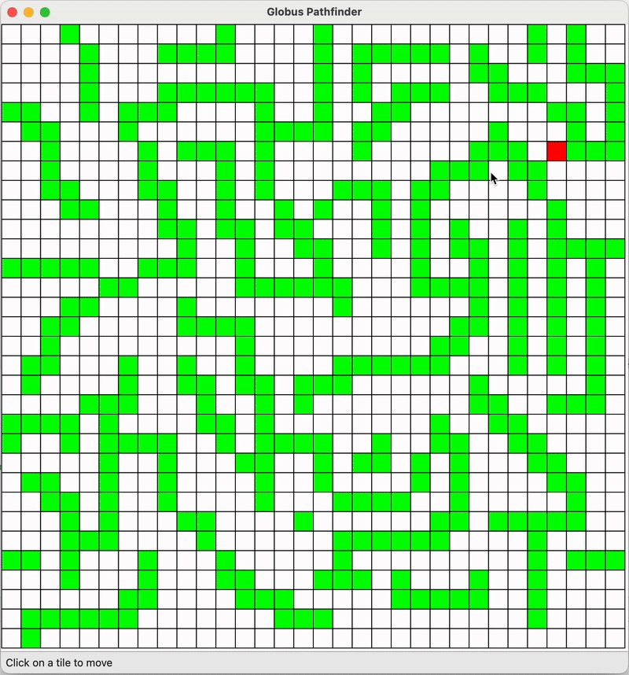

# Globus Pathfinder

## Project Summary
Globus Pathfinder is a Qt-based pathfinding tool that loads grid-based maps from JSON, allows interactive editing of the start/target positions, and visualizes the optimal route directly on the map.

This project is part of a take-home assignment.

## Demo

## Build instructions
The `src` folder contains a standard Qt 6 / CMake project that can be builded with QtCreator or from command line following these instructions:
https://doc.qt.io/qt-6/cmake-build-on-cmdline.html

## Usage
Use the left click to set starting position and the left click to set target position.
The file menu lets you import or export a map and export a path.

## Project Structure
- src/ — Application source code
    - CMakeLists.txt — CMake project file
    - main.cpp — Qt application entry point
    - resources.qrc - Qt resource file to embed the JSON map
    - assets/
        - sample_map.json — JSON Map loaded at the app startup
    - logic/
        - pathfinder.{cpp,h} — Pathfinding algorithm implementation (A*).
    - models/
        - gamemap.{cpp,h} - Model defining a map with start and target points
        - tile{cpp,h} - Model defining a single tile of the map
    - ui/
        - mainwindow.{cpp,h} — Main application window
        - mapview.{cpp,h} — Widget that renders the grid and path.
        - tileitem{cpp,h} - Single tile UI view with click signals
- .gitignore - Git ignore file
- README.md — Project documentation and usage (this file).

## Design Decisions
### Software architecture
I decided to split my code in 3 subfolders: UI, models and logic. This makes it easy to understand and maintain.
The UI is also splitted in 3 classes: 
- MainWindow for the File menu actions, the status bar and refresh timer
- MapView for drawing the map and path
- TileItem for drawing a single tile and sending signals when a tile is clicked

### UI/UX
For the UI/UX, I started with a static grid with just the visualization of the start, target and path as shown below:

With this view I was able to test the algorithm easily by changing the start position with the left click and the target position with the right click.

I then decided to implement it more like an actual game, where we click to set the target and the travel is animated and can be interrupted if we choose a new target during the travel.

### Pathfinding algorithm
For finding the path to the target position, I thought about 2 approaches:
- "GPS" approach, meaning we know the full map and we can find the quickest path before starting the travel
- "fog" approach, meaning we only know the tiles around us and where the target is. This is often the case in RTS games where the player discovers the map as it progresses

I chose to pick the first approach because we can easily know the shortest path to the target this way.
For the algorithm, A* is a classic pathfinding algorithm because it's very effective at finding the shortest path.